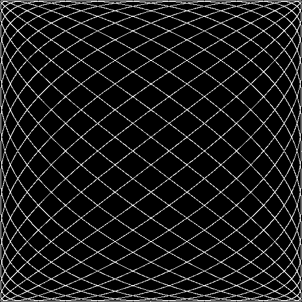

# josh-images

Made during @trptcolin's functional programming class.



```sh
$ lein uberjar
$ java -jar target/uberjar/josh-images-0.1.0-SNAPSHOT-standalone.jar
$ imgcat lol.gif
```

## Installation

Download from http://example.com/FIXME.

## Usage

FIXME: explanation

    $ java -jar josh-images-0.1.0-standalone.jar [args]

## Options

FIXME: listing of options this app accepts.

## Examples

...

### Bugs

...

### Any Other Sections
### That You Think
### Might be Useful

## License

Copyright © 2017 FIXME

Distributed under the Eclipse Public License either version 1.0 or (at
your option) any later version.
